<!--
  PRAESTO · README de perfil de GitHub
  Antes de publicar, reemplaza en la sección CONTACTO:
    TU_DOMINIO · TU_CORREO · TU_NUMERO (formato 51XXXXXXXXX) · TU_LINKEDIN
  Si un dato aún no existe, borra su badge completo.
-->

  

<!-- 01 · QUIÉNES SOMOS -->

  

<!-- 02 · SERVICIOS -->

  

<!-- 03 · LOGÍSTICA INTELIGENTE -->

 

  

<!-- 04 · POR QUÉ ELEGIRNOS -->

  

<!-- 05 · CÓMO TRABAJAMOS -->

  

<!-- 06 · MISIÓN Y VISIÓN -->

  

<!-- 07 · EQUIPO -->

  

<!-- 08 · CONTACTO -->

  

  

 

<b>🇬🇧 English</b>

 

**PRAESTO — Smart logistics for adventure.** We are a logistics operator based in Cusco, Peru, serving adventure tourism companies. We coordinate transfers, suppliers and trekking/camping equipment, with digital control of every service, so tour operators can focus on selling and guiding while we make sure everything arrives on time.

- **Praesto Ruta** — Transfer and supplier coordination: airport and hotel pick-ups in Cusco and the Sacred Valley, trailhead transfers, extras and last-minute changes, tracked per booking file.
- **Praesto Equipo** — Trekking and camping gear rental: duffels, tents, sleeping bags, mats and poles, with logged delivery, return and condition checks.
- **Praesto Control** — Operations management and automation: booking files, standardized service messages, supplier settlements and cost reports, automated with n8n and AI agents.

*Praesto* comes from Latin: "at hand", "ready", "present". Our promise: to be at the agreed place, at the agreed time.

